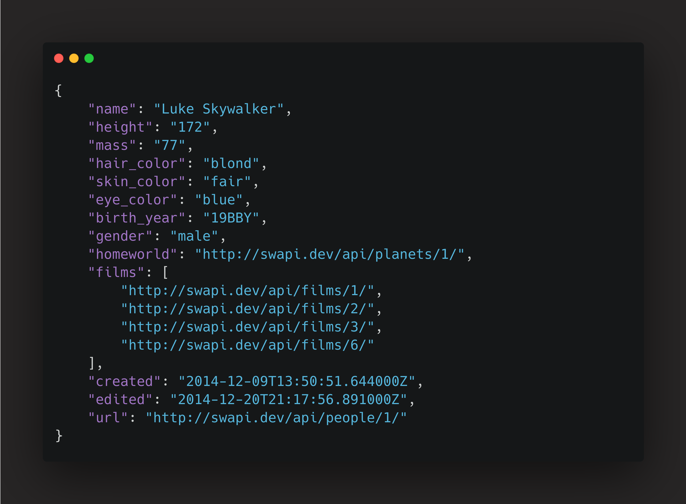

import Code from "mdx-code";
import { Head, Image, Appear } from "mdx-deck";
import { CodeSurfer } from "mdx-deck-code-surfer";

export { default as theme } from "./theme";

import { Cover } from "./Cover";
import { Intro } from "./Intro";
import { Img } from "./Img";

<Head>
  <title>GraphQL solves ?</title>
</Head>

<Cover />

---

<Intro />

---

# Overview

<ul>
  <Appear>
    <li>What is GraphQL ?</li>
    <li>Under fetching</li>
    <li>Over fetching</li>
    <li>Only one url</li>
    <li>Schemas</li>
    <li>Types</li>
    <li>Request numbers</li>
    <li>Documentation</li>
    <li>Live code</li>
  </Appear>
</ul>

---

## GraphQL vs REST

---

## What is an Under fetching

Under fetching is when you get less data than you need

---

## What is an Over fetching

It's when you get more data than you need (like some fields on the JSON that you don't need)

---

## How does it work ?

We need to get some data

<ul>
    
Name

    
Mass

    
Gender

</ul>

---

### REST api request

https://swapi.dev/api/people/1/

---

### Graphql api request

graphql query

graphql response

---

<CodeSurfer
  title="What is var, let and const?"
  code={require("!raw-loader!./VarLetConst.js")}
  showNumbers={false}
  dark={true}
  lang="js"
  steps={[
    { notes: "Let's see it" },
    { range: [1, 1], notes: "What would be `Var`" },
    { range: [10, 16], notes: "With scope global" },
    { range: [2, 2], notes: "What would be `Let`" },
    { range: [18, 22], notes: "Without scope global" },
    { range: [3, 3], notes: "What would be `Const`" },
    { range: [5, 7], notes: "Would be a constant" },
    { notes: "let's go" },
  ]}
/>
