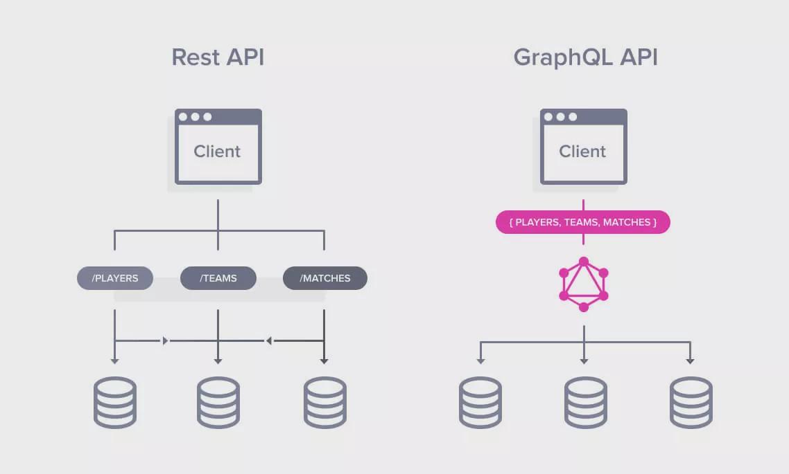
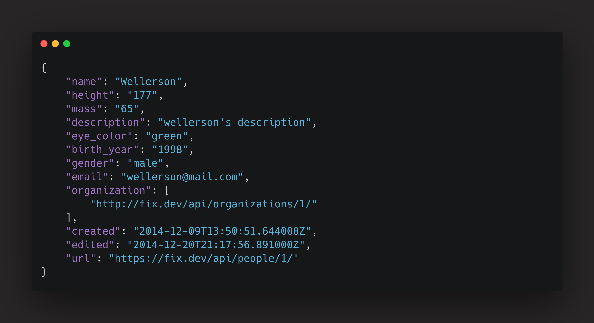
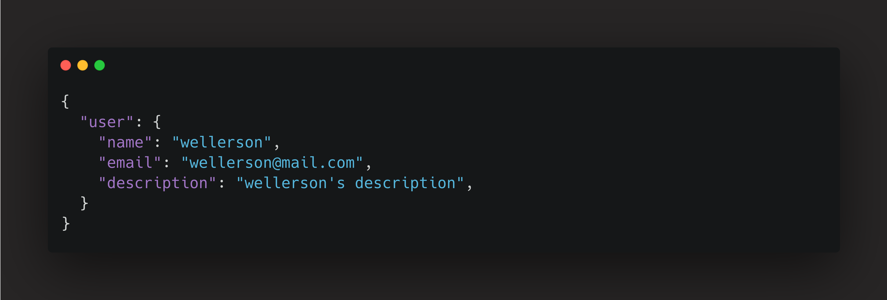
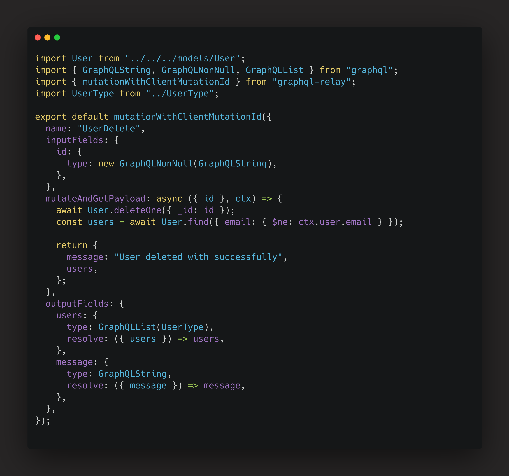
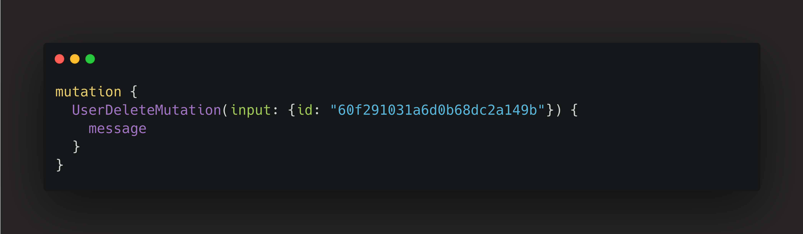
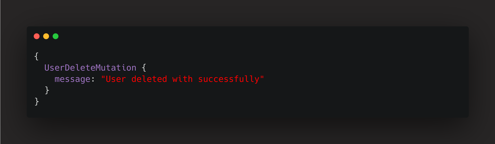
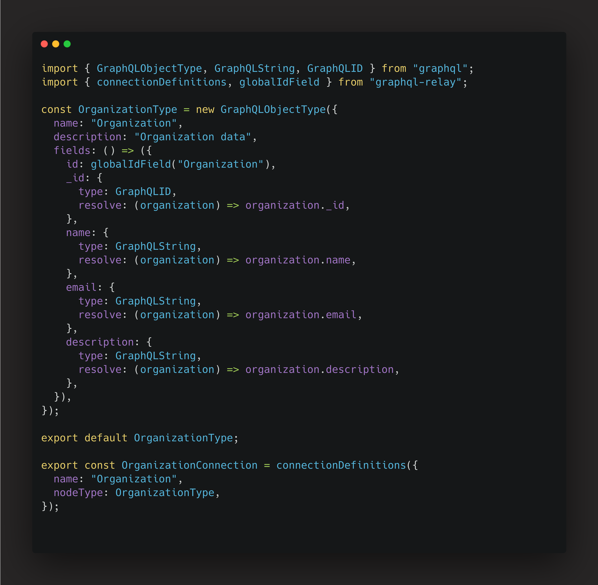
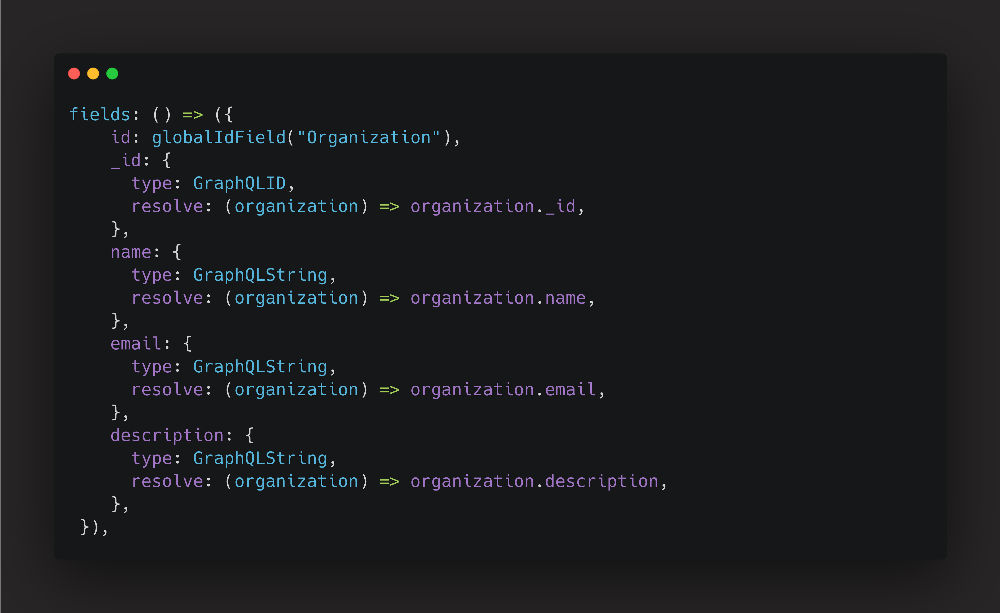
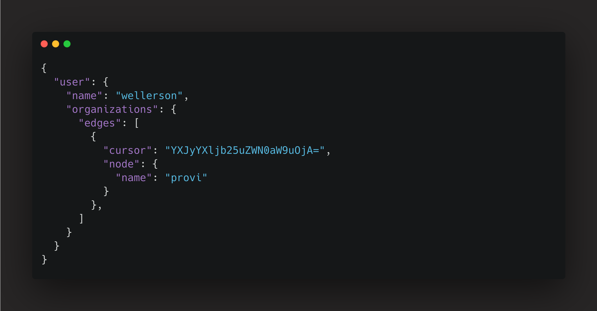

import Code from "mdx-code";
import { Head, Image, Appear } from "mdx-deck";

export { default as theme } from "./theme";

import { Cover } from "./Cover";
import { Intro } from "./Intro";
import { Img } from "./Img";

<Head>
  <title>GraphQL solves ?</title>
</Head>

<Cover />

---

<Intro />

---

# Motivation

<ul>
    
Data fetching

    
Pagination with cursor

    
Documentation

</ul>

---

# Overview

<ul>
    
What is GraphQL ?

    
Under fetching

    
Over fetching

    
Query

    
Mutation

    
URL version

    
GraphQL Object Type

    
Types

    
Request numbers

    
Cursor

    
Documentation

    
Code

</ul>

---

## GraphQL vs REST

---

## What is an Under fetching

Under fetching is when you get less data than you need

---

## What is an Over fetching

It's when you get more data than you need (like some fields on the JSON that you don't need)

---

## How does a query work?

We need to get some data

<ul>
    
Name

    
Email

    
Description

</ul>

---

### REST api request

https://fix.dev/api/user/60f291031a6d0b68dc2a149b/

---

### GraphQL Query type

---

### GraphQL api request

GraphQL query

---

### GraphQL api response

GraphQL response

---

### How does a mutation work?

---

### Using mutation

---
### Mutation response

---

### URL version

<ul>
    
https://fix.dev/api/v1/user/1/

    
https://fix.dev/api/v2/user/2/

    
https://fix.dev/api/v3/user/3/

</ul>

---

### GraphQL Object Type

---

### Types

---

### Request numbers

---

### With GraphQL

---

### Response

---

### Cursor Vs offset

