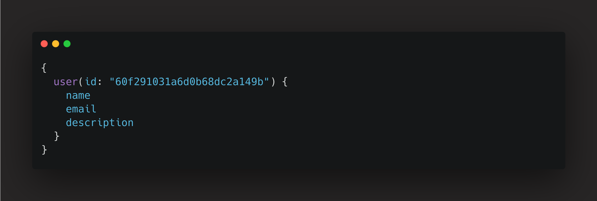
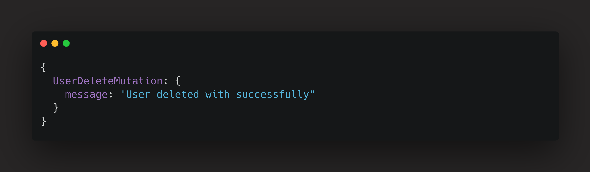
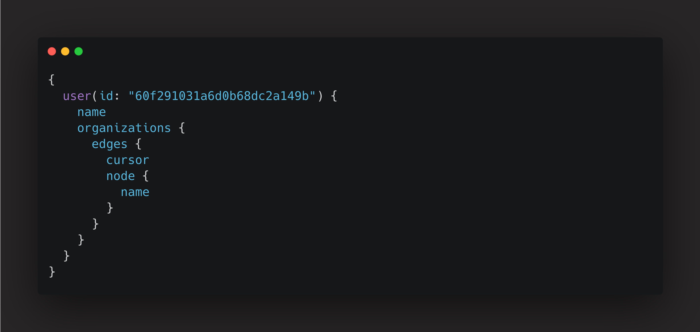

import Code from "mdx-code";
import { Head, Image, Appear } from "mdx-deck";

export { default as theme } from "./theme";

import { Cover } from "./Cover";
import { Intro } from "./Intro";
import { Img } from "./Img";
import { Thanks } from "./Thanks";

<Head>
  <title>GraphQL</title>
</Head>

<Cover />

---

<Intro />

---

# Motivation

<ul>
    
Data fetching

    
Pagination with cursor

    
Documentation

</ul>

---

# Overview

<ul>
    
What is GraphQL ?

    
Under fetching

    
Over fetching

    
Query

    
Mutation

    
URL version

    
GraphQL Object Type

    
Types

    
Request numbers

    
Cursor

    
Documentation

    
Code

</ul>

---

## GraphQL vs REST

---

## What is an Under fetching

Under fetching is when you get less data than you need

---

## What is an Over fetching

It's when you get more data than you need (like some fields on the JSON that you don't need)

---

## How does a query work?

We need to get some data

<ul>
    
Name

    
Email

    
Description

</ul>

---

### REST api request

https://fix.dev/api/user/60f291031a6d0b68dc2a149b/

---

### GraphQL Query type

---

### GraphQL api request

GraphQL query

---

### GraphQL api response

GraphQL response

---

### How does a mutation work?

###### rest vs graphql

---

### Delete an user

---

### define a mutation

---

### Using mutation

---
### Mutation response

---

### fetch N endpoints

---

### Get users list and user

---

### With Graphql

---

### URL version

<ul>
    
https://fix.dev/api/v1/user/1/

    
https://fix.dev/api/v2/user/2/

    
https://fix.dev/api/v3/user/3/

</ul>

---

### GraphQL Object Type

---

### Types

---

### Request numbers

---

### With GraphQL

---

### Response

---

### Pagination

#### Offset vs Cursor

---

### Cursor

---

### Delete Sam Drunk photos #1 and #2

---

### Page 2 no cat photos

---

### Documentation

---

### Documentation user

---

## References

- [Is offset pagination dead?](https://uxdesign.cc/why-facebook-says-cursor-pagination-is-the-greatest-d6b98d86b6c0)
- [Explaining GraphQL Connections](https://www.apollographql.com/blog/graphql/explaining-graphql-connections/)
- [How to implement Pagination and Mutation in GraphQL](https://buddy.works/tutorials/how-to-implement-pagination-and-mutation-in-graphql)
- [A deep dive into the Relay store](https://yashmahalwal.medium.com/a-deep-dive-into-the-relay-store-9388affd2c2b)

---

# Thanks